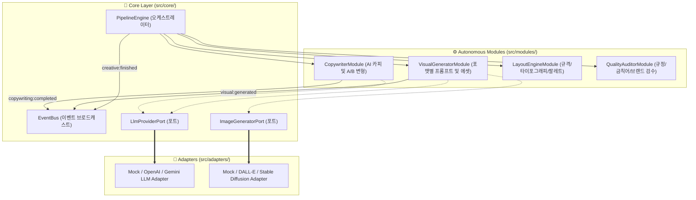

# 🎯 AdForge: AI 광고 자동 제작 시스템 (AI Ad Automatic Creation System)

`AdForge`는 다양한 광고 플랫폼(Meta, Google Display, TikTok, Naver 등)과 광고 형태(정적 배너, 스토리/릴스, 소셜 카루셀, 텍스트 카피 등)에 최적화된 **AI 광고 소재 자동 제작 및 검수 파이프라인**입니다.

---

## 🏗️ 모듈형 아키텍처 (Modular Architecture)

본 프로젝트는 **클린 아키텍처(Clean Architecture)** 및 **헥사고날 아키텍처(Ports & Adapters)** 원칙을 바탕으로 설계되었습니다. 각 기능(카피라이팅, 비주얼 생성, 레이아웃 엔진, 품질 검수)은 서로 독립적인 자율 모듈(`src/modules/`)로 분리되며, 외부 AI 모델 API 및 저장소 등은 어댑터(`src/adapters/`)로 교체 가능하도록 결합도를 최소화했습니다.



---

## 📁 디렉토리 구조

```
c:/adforge/
├── package.json                   # Bun + TypeScript 프로젝트 설정
├── tsconfig.json                  # TypeScript Compiler 옵션 및 모듈 경로 별칭 (@core, @modules, @adapters 등)
├── src/
│   ├── types/
│   │   └── ad-types.ts            # 광고 채널, 포맷, 캠페인 요청 및 크리에이티브 결과물 타입
│   ├── config/
│   │   └── env.ts                 # Zod 기반 환경 변수 검증 및 로더
│   ├── core/
│   │   ├── events/
│   │   │   └── event-bus.ts       # 모듈 간 비동기 이벤트 전달용 Event Bus
│   │   ├── ports/
│   │   │   ├── llm-provider.port.ts     # LLM AI 인터페이스
│   │   │   └── image-generator.port.ts  # 비주얼/비디오 AI 인터페이스
│   │   └── pipeline/
│   │       └── pipeline-engine.ts       # 단계별 AI 소재 생성 파이프라인 제어 엔진
│   ├── modules/
│   │   ├── copywriter/
│   │   │   └── copywriter.module.ts     # AI 카피라이팅 및 A/B 변형 생성 모듈
│   │   ├── visual/
│   │   │   └── visual-generator.module.ts # 비율(1:1, 16:9, 9:16) 맞춤 비주얼 생성 모듈
│   │   ├── layout/
│   │   │   └── layout-engine.module.ts    # 포맷별 반응형 레이아웃 및 폰트 규격 계산 모듈
│   │   └── quality/
│   │       └── quality-auditor.module.ts  # 금칙어 필터 및 브랜드 안전성 검수 모듈
│   ├── adapters/
│   │   ├── llm/
│   │   │   └── mock-llm.adapter.ts      # LLM 어댑터 (OpenAI, Gemini 등으로 즉시 교체 가능)
│   │   └── image-gen/
│   │       └── mock-image.adapter.ts    # Image/Video 생성 어댑터
│   └── index.ts                   # 시스템 진입점 및 실시간 분석기 데모 CLI
└── tests/
    ├── pipeline.test.ts           # 파이프라인 엔진 및 모듈 단위 테스트
    ├── review-cleaner.test.ts     # Sprint 2: 리뷰 전처리 및 광고점수(adScore) 단위 테스트
    └── review-intelligence.test.ts# Sprint 2: 11개 카테고리 광고 인텔리전스 스키마 통합 테스트
```

---

## 🚀 빠른 시작 (Quick Start with Bun)

### 1. 패키지 설치
```bash
bun install
```

### 2. 실시간 상품 & 고객 리뷰 광고 데이터 분석 실행 (Sprint 1 & 2 Demo)
실제 네이버 스마트스토어 / 브랜드스토어 상품 URL 하나를 입력하면 상품 정보와 300개의 리뷰를 수집하여 **광고 문구, 고객 생생 언어, 구매 동기, 반론 극복 사례**를 자동 추출하고 `data/<campaignId>/`에 저장합니다.
```bash
# 기본 데모 URL 실행
bun run dev

# 특정 상품 URL 지정 실행
bun run dev "https://brand.naver.com/osulloc/products/10120190602"
```

### 3. 단위 테스트 실행
```bash
bun test
```

---

## 🔥 주요 스프린트 구현 내용

### 🕷️ Sprint 1 & 1.5: 실시간 상품 분석기 (`ProductAnalyzerModule`)
- **Playwright 기반 SmartStore / BrandStore 실시간 DOM + State 파서**
- OpenGraph에 의존하지 않고, **Multi-Layer Selector Fallback (`DOM` -> `__PRELOADED_STATE__` -> `JSON-LD` -> `OG`)** 전략으로 상품명, 브랜드, 할인가/정가, 대표 이미지, 상세 이미지 목록, 옵션, 리뷰 개수 및 평점을 추출합니다.
- Zod 스키마 검증 통과 후 `01_product_analysis.json`에 영구 저장합니다.

### 🧠 Sprint 2: 광고용 리뷰 인텔리전스 엔진 (`ReviewIntelligenceModule`)
- 단순 리뷰 요약 AI가 아닌 **"고객이 광고를 대신 써주는 엔진 (`고객이 광고를 대신 써주는 엔진`)"**으로 작동합니다.
- **실제 리뷰 API-First 수집 (`SmartStoreReviewAdapter`)**: 브라우저 Fetch 연계를 통해 API endpoint로부터 구매자 인증 여부, 도움수 포함 리뷰를 빠르게 수집합니다.
- **광고 인용 가치 점수 (`adScore`)**: 단답형 리뷰를 걸러내고, 구체적 경험·전후 대비·감정 표현(Delight, Surprise, Satisfaction 등)에 높은 점수를 부여하여 `adScore >= 80`점 이상의 **`adCandidateReviews`**를 큐레이션합니다.
- **11개 핵심 카테고리 구조화**:
  1. `customerLanguage`: 고객 실제 언어 원문 + 감정 태그 + 빈도
  2. `purchaseReasons`: TOP 구매 동기
  3. `objections`: 가격, 신뢰, 효과별 반론 극복 사례
  4. `adHooks`: 첫 3초 강력 훅 문구
  5. `evidences`: 원문 리뷰 ID 출처 매핑 (Evidence Engine 연계)
- 산출물은 `02_review_raw.json`, `03_review_intelligence.json`, `customer_language.json`에 영구 저장됩니다.

---

## ✨ 지원하는 광고 출력 포맷 (`AdFormat`)
1. `STATIC_BANNER`: 디스플레이 이미지 배너 (예: 1200x628, 1080x1080)
2. `CAROUSEL_CARD`: 소셜 카루셀 카드 슬라이드
3. `STORY_REELS`: 9:16 세로형 숏폼 스토리/릴스/틱톡 소재
4. `VIDEO_AD`: 16:9 표준 동영상 광고 소재
5. `TEXT_COPY`: 검색 및 피드 텍스트 전용 카피
6. `HTML5_BANNER`: 인터랙티브 HTML5 배너
